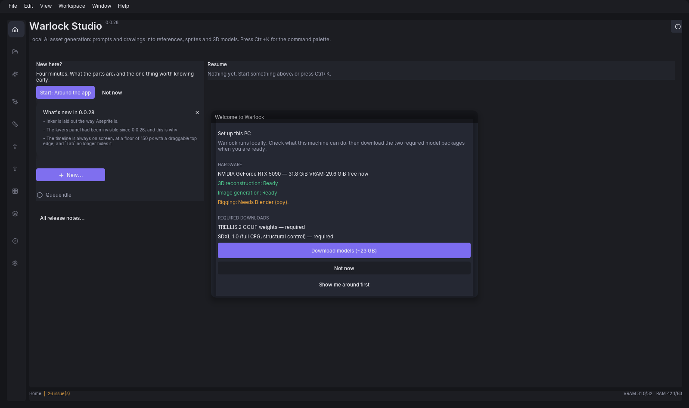

# Installing Warlock Studio

This guide walks you through downloading, installing, and confirming that Warlock Studio works on your PC. No coding experience or developer tools are required — just follow the steps in order.

This covers the packaged Windows installer only. If you want to run Warlock Studio from source or contribute to it, see `README.md` instead.

## What you'll need

- **Windows 10 or 11, 64-bit.** There is no macOS or Linux build, and no CPU-only mode — an NVIDIA GPU is required, not optional.
- **An NVIDIA GPU with CUDA, 16 GB VRAM or more.** Tested on an RTX 5090 (32 GB); a 4080/5080-class card or better is a comfortable fit. Keep your NVIDIA driver up to date via the NVIDIA app or GeForce Experience.
- **32 GB of system RAM**, recommended. Windows counts the GPU's memory allocation against your system RAM as well as VRAM, so a low-RAM machine can refuse to start jobs even when VRAM is free.
- **About 35 GB of free disk space** — the installed program takes about 6.6 GB (it unpacks to well over twice the size of the 2.9 GB download), plus about 23 GB for the two AI model downloads on first launch, plus room for the download itself while it installs.
- **A 1920×1080 or larger display** at 100% scaling. The app window opens at 1600×950.
- You do **not** need to install Python, `uv`, or any other developer tools — the installer bundles its own Python runtime and everything else it needs to run.

## Step 1: Download Warlock Studio

1. Go to the **Releases** page of the [Warlock Studio GitHub repository](https://github.com/jmbell88/warlock-studio) and open the latest release.
2. Under **Assets**, download `WarlockSetup-v0.0.31.exe` — a single file of about **2.9 GB**. There is nothing to unzip and no other file to fetch alongside it.
3. Wait for the download to finish before opening it. Your browser may warn that a file this large is unusual; it isn't, for an installer that carries its own Python runtime and GPU libraries.

## Step 2: Install Warlock Studio

1. Double-click `WarlockSetup-v0.0.31.exe`.
2. **Windows will very likely show a blue "Windows protected your PC" screen. This is expected — it is not a virus warning.** Windows SmartScreen flags installers from publishers who haven't paid for code-signing, regardless of whether the software is safe. Click **More info**, then click **Run anyway** to continue.
3. The first wizard page is the **license agreement** (GPL-3.0-or-later). Read it if you like, then accept and continue.
4. Optional: tick **Create a desktop shortcut** if you'd like one. It's unchecked by default — a Start Menu shortcut is created either way.
5. You won't be asked for an administrator password. Warlock Studio installs just for your Windows user account, into `%LOCALAPPDATA%\Programs\Warlock Studio`.
6. Click **Install** and wait — it's unpacking about 6.6 GB, so this can take a few minutes depending on your disk speed.
7. Click **Finish**. Two new Start Menu shortcuts now exist:
   - **Warlock Studio** — the app itself
   - **Warlock Doctor** — a diagnostic tool that checks your install, GPU, and models (more on this under Troubleshooting below)

## First launch

Open the Start Menu and launch **Warlock Studio**.

The first time it opens, a **Set up this PC** panel appears:

It runs three live checks against your actual GPU and VRAM — not a guess:

| Check | What it means |
|---|---|
| 3D reconstruction | Whether your GPU has enough free VRAM for the 3D pipeline |
| Image generation | Whether the image model fits your VRAM budget |
| Rigging | Whether the rigging tool is available |

Below that, it lists the two downloads it needs, with sizes, and tells you up front if your disk doesn't have room:

- **TRELLIS.2 GGUF weights** — about 16 GB
- **SDXL 1.0** — about 7 GB

Two buttons:

- **Download models** — starts both downloads in the background. The app stays fully usable (and offline) otherwise.
- **Not now** — skip for later. The same downloads are always reachable at **Settings → Models**.

A few things worth knowing so you don't worry unnecessarily:

- There's no time estimate shown, since it depends entirely on your internet connection. It's fine to leave it running and come back later.
- A cancelled or failed download is safe to retry — it doesn't leave a broken, half-downloaded mess behind.
- Most of the app — drawing, tile maps, the asset library, and more — works immediately with **zero downloads**. Only AI image and 3D generation need the two model packages, so the rest of the app isn't "broken" while they finish.

Separately, the Home screen offers a dismissible **"New here?"** guided tour with **Start** and **Not now** buttons. It's entirely optional and never launches on its own.

When it opens, you'll see a rail on the left with **Home**, **Library**, and **Create**, then seven creative workspaces — **Inker**, **Clay**, **Poser**, **Troupe**, **Plotter**, **Packwright**, and **Sirens** — with **Review** and **Settings** tucked into the footer.

Everything you make and download lives at `%USERPROFILE%\.warlock` (`assets/`, `models/`, `palettes/`) — worth knowing if you ever want to back it up or check how much space it's using.

## Uninstalling

1. Open Windows **Settings → Apps → Installed apps** (or **Control Panel → Programs → Uninstall a program**).
2. Find **Warlock Studio** and click **Uninstall**.
3. A confirmation message tells you your assets and downloaded models are being kept. Uninstalling does **not** delete `%USERPROFILE%\.warlock`, so you won't lose your work — and reinstalling later won't require re-downloading the ~23 GB of models.

## Troubleshooting

- **Warlock Doctor**, in the Start Menu, re-runs the same first-run diagnostic checks any time you want to check your setup again.
- If the SmartScreen prompt during installation is what's worrying you, that's expected — see Step 2 above.
- For anything else — crashes, out-of-memory errors, missing weights, a stuck GPU worker — see the full guide at `docs/manual/42-troubleshooting.md`.
