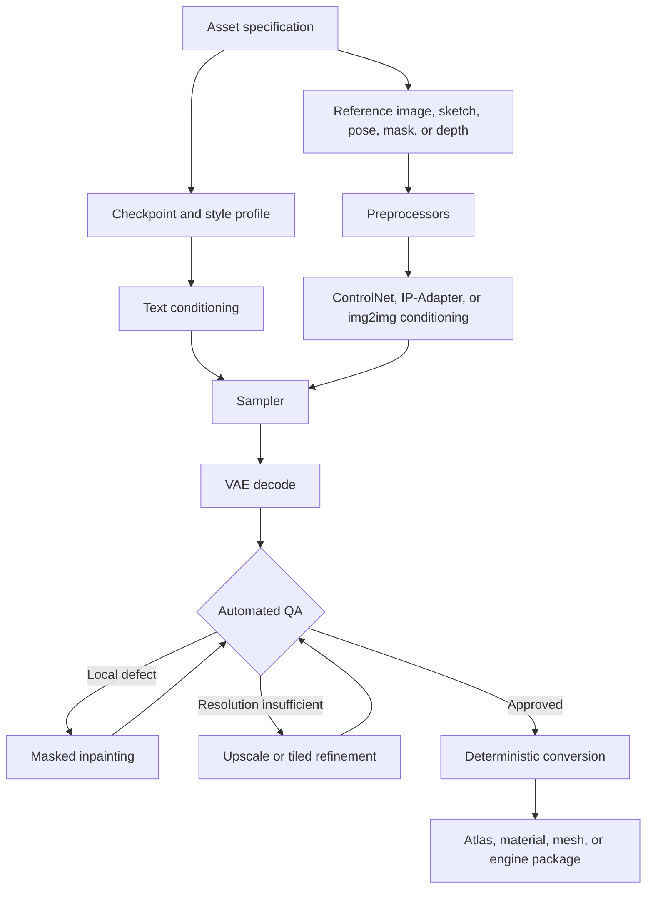
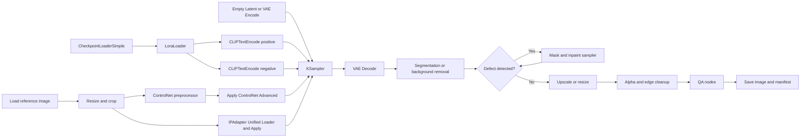
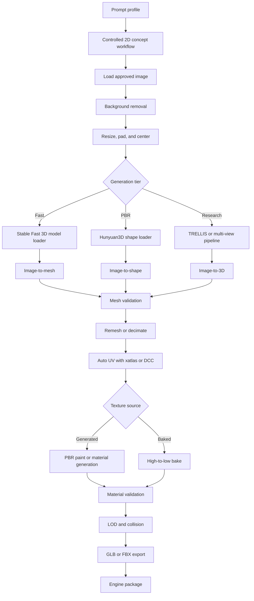
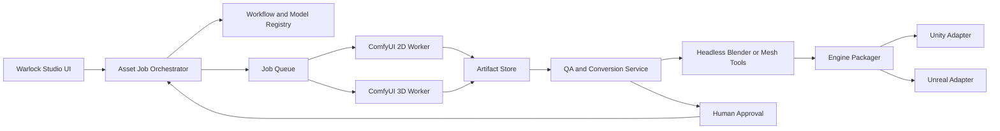
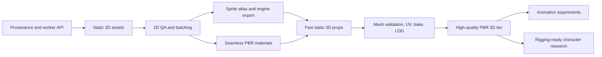

# ComfyUI and AI Pipelines for Game-Ready 2D and 3D Assets in Warlock Studio

## Executive summary

ComfyUI is best understood as a **visual orchestration and automation layer**, not as a single asset generator. Its node graph can combine diffusion checkpoints, LoRAs, ControlNet preprocessors, reference-image adapters, masking, inpainting, upscaling, depth estimation, 3D reconstruction, file conversion, and external scripts into repeatable workflows. ComfyUI can also run headlessly through REST and WebSocket APIs, making it suitable as a backend worker for Warlock Studio rather than merely an artist-facing GUI.

The strongest current use cases for low-touch production are:

| Asset category | Practical readiness | Likely post-editing | Main remaining risks |
|---|---:|---:|---|
| Icons, inventory objects, card art, UI illustrations | High | Low | Alpha cleanup, exact style matching, text defects |
| Static sprites and cutout characters | High | Low–medium | Anatomy, consistent silhouettes, pivot alignment |
| Pixel-art concepts and individual sprites | Medium | Medium | Pixel clusters, palette discipline, animation consistency |
| Tileable surface textures | High with specialized material workflows | Low | Edge seams, directional lighting, scale consistency |
| PBR material sets | Medium–high | Low–medium | Channel alignment, physical plausibility, engine conventions |
| Sprite animations | Medium | Medium–high | Frame-to-frame identity, limb continuity, timing |
| Static 3D props | Medium–high | Medium | Hidden geometry, topology, UV layout, collision, LODs |
| Low-poly environment assets | Medium | Medium | Silhouette preservation after decimation, bake cleanup |
| High-poly concept sculpts | High as concept geometry | Low–medium | Surface noise and downstream retopology |
| Rigging-ready humanoids or creatures | Low–medium | High | Edge flow, symmetry, joint deformation, separate parts |
| Production skeletal characters with facial rigs | Low | High | Topology, blendshapes, animation compatibility |

The central finding is that **minimal post-editing comes from constraining generation before and during inference**, then applying deterministic validation and conversion afterward. Prompt-only generation is rarely enough. Successful workflows use approved silhouettes or sketches, fixed camera conventions, style references, LoRAs, ControlNet, IP-Adapter, standardized masks, deterministic seeds, inpainting passes, and automated output checks. Community sprite workflows likewise tend to combine pose or outline controls with LoRAs or image references because prompt-only consistency remains unreliable, especially across animation frames.

For 2D production, Warlock Studio should initially prioritize **static sprites, icons, UI ornamentation, props, tileable materials, and controlled variations**. These can often be generated close to final form when templates enforce canvas size, framing, transparency, palette, outline thickness, lighting direction, and engine import metadata. Animated sprites should be treated as a separate, higher-risk feature with temporal or pose conditioning and explicit frame QA.

For 3D production, the recommended pattern is:

```mermaid
flowchart LR
    A[Prompt and art profile] --> B[Controlled 2D concept]
    B --> C[Background removal and framing]
    C --> D[Image-to-3D shape generation]
    D --> E[Mesh validation]
    E --> F[Remesh or retopology]
    F --> G[UV unwrap]
    G --> H[PBR texture generation or baking]
    H --> I[LOD and collision generation]
    I --> J[Unity or Unreal package]
```



This is more controllable than direct text-to-3D because the approved concept image serves as an explicit visual contract. Feed-forward image-to-3D systems such as Stable Fast 3D, Hunyuan3D, InstantMesh-derived tools, and TRELLIS-style models are generally better candidates for production automation than older DreamFusion-style per-asset optimization. Stable Fast 3D directly produces UV-unwrapped GLB assets, predicts material parameters, and can run with approximately 6 GB of VRAM at default settings. Hunyuan3D 2.1 separates shape and PBR texture generation but lists approximately 10 GB for shape generation, 21 GB for texture generation, and 29 GB for both together. TRELLIS.2 can export PBR-ready GLB assets, but its published speed figures are measured on an NVIDIA H100 and should not be interpreted as consumer-GPU performance.

The recommended Warlock Studio architecture is to keep ComfyUI isolated behind a **job-oriented asset-generation service**. Warlock Studio should own project profiles, prompts, workflow versioning, model hashes, licenses, validation rules, engine packaging, and provenance. ComfyUI should own model execution and graph processing. This separation reduces dependency breakage and makes it possible to replace individual models without changing the editor-facing feature.

## Scope, assumptions, and production definition

This report assumes that Warlock Studio is an extensible game-development or asset-authoring application with Python-capable tooling, but that its final engine, target hardware, rendering pipeline, camera perspective, and art style have not yet been fixed. Consequently, the proposed system uses **profiles** rather than one universal configuration.

The principal assumptions are:

| Area | Working assumption | Consequence for design |
|---|---|---|
| Target platforms | Unspecified desktop, mobile, web, or console | Texture formats, polygon budgets, atlas sizes, and shader complexity must be profile-driven |
| Art styles | Unspecified realistic, painterly, pixel art, low-poly, or stylized | Checkpoints, LoRAs, prompts, downsampling, and QA rules must be swappable |
| Game engine | Unity and Unreal are both possible | Export adapters should share a neutral intermediate manifest |
| Camera | May include top-down, side view, isometric, or perspective | Each asset profile needs an approved camera and framing convention |
| Asset ownership | Commercial game use is expected | Every model, LoRA, dataset-derived component, and custom node needs a recorded license |
| Hardware | Local consumer GPU and remote GPU workers may coexist | Jobs need hardware capability tags and fallback workflows |
| Human review | Minimal editing is desired, but review remains acceptable | Human approval should occur at controlled gates rather than after every node |
| Rigging | Static props are the likely first 3D target | Rigging-ready characters should remain a later research milestone |

“Game-ready” should not mean merely “opens in the engine.” For Warlock Studio, an asset should only be classified as game-ready after it passes an explicit asset contract.

For 2D assets, that contract should include dimensions, color space, alpha mode, pivot, trim bounds, atlas padding, palette or style profile, absence of unintended text, and optional secondary textures such as normal or mask maps. Unity, for example, supports sprite secondary textures for normal and mask data, while sprite atlases provide a formal packing mechanism; import and texture-compression settings still differ by target platform.

For 3D assets, the contract should include scale and units, coordinate orientation, pivot, mesh bounds, manifold policy, material slots, UV requirements, texel density, triangle budgets, LODs, collision, tangent basis, normal-map convention, texture resolution, and engine-specific import settings. Unreal’s FBX pipeline can carry static meshes, skeletal meshes, animations, morph targets, materials, textures, and multiple LODs, but Epic specifies FBX 2020.2 for its documented pipeline.

The report uses “minimal post-editing” to mean that routine corrections are automated or incorporated into the graph, while a human mainly selects, approves, or rejects results. It does **not** imply that arbitrary generated characters can safely bypass retopology, deformation testing, collision setup, or visual review.

## Current workflow and tool landscape

ComfyUI’s main production advantage is graph composability. Nodes pass models, conditioning, latent tensors, masks, images, geometry, or metadata through a directed workflow. Custom nodes expand the graph beyond image diffusion, and ComfyUI can expose workflows through an HTTP server for programmatic submission, file upload, output retrieval, and progress reporting.

A generalized production workflow looks like this:



### Pipeline components

| Component | Primary function | Best game-asset uses | Advantages | Limitations |
|---|---|---|---|---|
| Base checkpoint | Establishes broad visual distribution | Concepts, sprites, icons, textures | Large capability base; reusable | Style and structure may drift |
| LoRA | Applies a learned style, subject, costume, or object vocabulary | Project art style, faction motifs, recurring props | Small adapter weights; easier to version than a full checkpoint | Overtraining can reduce variation or distort anatomy |
| ControlNet | Constrains structure using edges, line art, depth, pose, segmentation, or other hints | Sprite silhouettes, tile layouts, poses, orthographic views | Strong spatial control | Excessive strength can flatten detail or copy defects |
| IP-Adapter | Conditions generation on one or more reference images | Style matching, recurring subject identity, visual families | Fast reference transfer without training a full LoRA | Can import unwanted composition or background traits |
| img2img | Regenerates from an input image at controlled denoise | Variants, restyling, concept cleanup | Straightforward and controllable | High denoise loses structure; low denoise changes little |
| Inpainting | Regenerates masked regions | Hands, borders, seams, missing details, alpha edges | Avoids discarding an otherwise good asset | Mask quality and context strongly affect output |
| Depth-to-image | Constrains composition with estimated or authored depth | Relief-like assets, consistent volume, multi-view concepts | Better spatial continuity than prompt-only generation | Monocular depth can be wrong or scale-ambiguous |
| Upscaler | Enlarges and restores detail | UI artwork, textures, large sprites | Can produce high-resolution outputs efficiently | May invent texture or create inconsistent edges |
| Background removal and segmentation | Produces masks and isolated objects | Sprites, icons, image-to-3D inputs | Standardizes downstream framing | Thin details and translucent materials remain difficult |
| 3D reconstruction model | Converts image or text conditioning to geometry | Static props, concept meshes, environment pieces | Rapid geometry creation | Hidden surfaces and topology are inferred |
| UV and mesh processors | Unwrap, remesh, simplify, validate, or export | All runtime meshes | Deterministic and testable | May require external compiled dependencies |
| PBR estimator | Derives aligned material channels | Surfaces and generated meshes | Reduces manual map authoring | Lighting baked into inputs can contaminate results |

LoRA originated as a parameter-efficient adaptation method that injects trainable low-rank updates rather than retraining all model weights. In asset production, that makes it useful for distributing a Warlock Studio art-style adapter or object-family adapter independently from a large base checkpoint. IP-Adapter fills a different role: its ComfyUI implementation describes it as image-to-image conditioning capable of transferring subject or style, informally comparable to a “one-image LoRA.”

ControlNet preprocessors convert source images into hint images such as Canny edges, line art, scribbles, pose, or depth. The widely used `comfyui_controlnet_aux` package provides dedicated preprocessors and an all-in-one preprocessor node, although dedicated nodes expose more threshold controls.

### Common ComfyUI extensions

| Extension or repository | Role | Production assessment |
|---|---|---|
| ComfyUI-Manager | Installs, updates, enables, and disables custom nodes | Useful during development; production should still pin exact commits and block automatic unreviewed updates |
| `comfyui_controlnet_aux` | Edge, line, pose, depth, and other ControlNet hint preprocessors | Core dependency for controlled 2D generation |
| ComfyUI IPAdapter Plus | Reference-image style, composition, and subject conditioning | Core dependency for project-wide style consistency |
| ComfyUI Impact Pack | Detailers, detectors, regional correction, and upscale workflows | Useful for automated defect repair and masked refinement |
| ComfyUI Essentials | Resizing, image manipulation, masking, and utility operations | Useful for standardization and deterministic processing |
| Advanced ControlNet | More granular ControlNet scheduling and masking | Valuable for controlling when and where structure dominates |
| ComfyUI-3D-Pack | Mesh, UV, NeRF, 3D Gaussian, multi-view, and reconstruction nodes | Broad research platform; dependency complexity is substantial |
| Stable Fast 3D nodes | Single-image GLB generation with UV and material prediction | Strong low-VRAM static-prop prototype |
| Hunyuan3D wrappers | Shape and texture generation | Strong higher-end PBR candidate; heavy VRAM requirements |
| Specialized PBR suites | Material-map generation and processing | Useful, but alignment and licensing must be evaluated per implementation |

ComfyUI-Manager is officially documented as a way to manage custom nodes, but custom nodes execute code on the machine. ComfyUI’s documentation warns users to treat them as software installations rather than harmless workflow files. Warlock Studio should therefore use an approved-node registry, locked hashes, isolated environments, and no arbitrary node installation from user-supplied workflows.

### PBR material generation

The most important distinction is between **independently generated maps** and **jointly aligned material estimation**. Independently prompting an albedo, normal map, roughness map, and metalness map can create visually plausible channels that disagree spatially. A crack may appear in the albedo but not in the normal map; a metallic region may not align with the object’s painted metal.

Ubisoft La Forge’s Generative Base Material prototype demonstrates the more production-oriented pattern: first generate a seamless tileable texture from text and optional line art, sketch, or height conditioning; then use the CHORD architecture to derive aligned base-color, normal, height, roughness, and metalness channels; finally upscale the material maps by 2× or 4×.

This suggests the following ranking for Warlock Studio material creation:

| Method | Alignment | Edit requirement | Recommended use |
|---|---:|---:|---|
| Joint PBR material model | High | Low | Preferred for procedural surface materials |
| RGB-to-material decomposition | Medium–high | Low–medium | Converting approved photographs or generated textures |
| Mesh-space multi-view PBR texturing | Medium–high | Medium | Generated 3D props |
| Independent diffusion per channel | Low | High | Concept experiments only |
| Procedural derivation from height/base color | Medium | Medium | Stylized materials with predictable rules |
| High-to-low baking | High | Medium | Final normal, AO, curvature, and ID maps for runtime assets |

Depth and normal estimation can supplement the pipeline. Depth Anything V2 is intended for detailed and robust monocular depth estimation, while StableNormal targets sharp and stable surface-normal estimation. These outputs are useful as conditioning, relief sources, quality checks, or approximate secondary maps, but they are not substitutes for a true high-to-low bake when exact geometric correspondence is required.

UV generation should normally remain deterministic. Libraries such as xatlas generate unique UV charts suitable for texture baking and painting. Diffusion can help create texture content, but there is little production advantage in asking a generative model to invent UV coordinates when established packing algorithms are measurable and repeatable.

### Three-dimensional generation approaches

| Approach | Representative systems | Output | Strengths | Weaknesses | Warlock recommendation |
|---|---|---|---|---|---|
| Single-image feed-forward mesh | Stable Fast 3D, TripoSR, SPAR3D | Mesh or GLB | Fast; easy to automate; works from approved concepts | Hidden surfaces inferred; topology often irregular | Best starting point for static props |
| Multi-view diffusion plus reconstruction | InstantMesh, Wonder3D-style pipelines | Multi-view images and mesh | Better coverage and consistency than one view | More compute and camera-management complexity | Use for important props |
| Shape plus PBR texture pipeline | Hunyuan3D 2.1 | Shape and physically based textures | Strong material pipeline; open weights and training code | High VRAM, compiled dependencies, generated topology still needs validation | Higher-quality server tier |
| Structured latent 3D generation | TRELLIS and TRELLIS.2 | Mesh, Gaussian or radiance representation; PBR GLB in TRELLIS.2 | High detail and multiple representations | Heavy model and dependency stack; hardware claims may be datacenter-specific | Research and premium asset tier |
| Optimization-based text-to-3D | DreamFusion, Magic3D, ProlificDreamer | NeRF or optimized mesh | Flexible text-driven 3D research; conceptually important | Slow per asset, harder to reproduce, common view inconsistency or oversmoothing issues | Not the default production path |
| NeRF or 3D Gaussian reconstruction | Instant-NGP, 3DGS workflows | Neural field or point-based scene | Strong novel-view rendering and captures | Collision, rigging, UVs, and conventional mesh export are awkward | Backgrounds, scans, reference captures |
| High-poly generative sculpt | Various image-to-3D systems at high resolution | Dense mesh | Good visual prototype and bake source | Requires retopology and cleanup | Treat as source geometry, not runtime geometry |

DreamFusion introduced score-distillation sampling to optimize a NeRF from a text-to-image diffusion prior. Magic3D used a coarse-to-fine process and optimized a higher-resolution textured mesh, while ProlificDreamer proposed variational score distillation to address issues such as oversaturation, oversmoothing, and limited diversity. These methods remain academically important, but feed-forward image-to-3D systems are generally easier to batch, cache, rerun, and fit into editor workflows.

ComfyUI-3D-Pack integrates mesh and UV processing alongside NeRF, 3D Gaussian, InstantMesh, CRM, TripoSR, and related workflows. Its repository also notes native-build dependencies for some NeRF and mesh-conversion operations, making containerization or a dedicated worker image preferable to installing the stack directly inside the Warlock Studio process.

## Recommended reproducible pipeline for two-dimensional assets

The recommended initial 2D implementation is an **SDXL-class controlled-generation pipeline** with project-specific LoRAs, ControlNet, IP-Adapter, fixed seeds, standardized output transforms, masked correction, and engine-aware packaging. SDXL supports a base-plus-refiner design and can also be used in image-to-image workflows, although using a refiner should be optional because it adds latency and can weaken strict stylization.

### Target asset profiles

Warlock Studio should expose asset profiles rather than raw model controls:

| Profile | Canvas and camera | Required conditioning | Output processing |
|---|---|---|---|
| Inventory icon | Square, centered, one object | Style reference, optional silhouette | Background removal, trim, padding, alpha cleanup |
| Static character sprite | Fixed camera, fixed stance or pose | Pose or outline ControlNet, character LoRA or reference | Mask refinement, pivot placement, optional normal map |
| Top-down prop | Orthographic or prescribed slight perspective | Outline, depth, or reference image | Shadow policy, scale normalization, collision footprint metadata |
| Isometric asset | Fixed azimuth and elevation | Depth or line-art guide | Grid alignment and standardized anchor |
| Tileable surface | Orthographic texture view, no perspective | Optional height or sketch | Offset seam test, seam inpaint, map derivation |
| UI panel | Fixed dimensions and safe zones | Layout mask or line art | Nine-slice border metadata and text exclusion |
| Pixel-art sprite | Generated large, then downsampled | Strong silhouette and style controls | Nearest-neighbor reduction, palette quantization, cluster checks |

### Baseline node graph

Exact node names vary between extension versions, but a reproducible graph should be functionally equivalent to:



### Suggested baseline parameters

These values are **starting points for calibration**, not universal optimums:

| Parameter | Starting range | Rationale |
|---|---:|---|
| Native generation size | Approximately 1024 px on the long side for SDXL-class models | Preserves composition and detail before deterministic resizing |
| Sampler | DPM++ 2M SDE or DPM++ 2M with Karras-style scheduling | Common quality and stability baseline |
| Steps | 24–32 | Usually enough for controlled production without excessive latency |
| CFG | 5–7 | Reduces extreme prompt forcing and oversaturation |
| Text-to-image denoise | 1.0 | Starts from noise |
| img2img denoise | 0.35–0.65 | Lower preserves source; higher allows substantial redesign |
| Inpaint denoise | 0.25–0.50 | Repairs local defects without rebuilding the asset |
| ControlNet strength | 0.55–0.85 | Strong enough to preserve silhouette while allowing texture |
| ControlNet end percentage | 0.70–0.90 | Allows late diffusion steps to restore natural details |
| IP-Adapter style weight | 0.35–0.65 | Provides style influence without copying the reference too literally |
| LoRA weight | 0.60–0.90 | Common calibration range for style adapters; test per LoRA |
| Seed | Fixed per approved variant | Enables reruns and controlled parameter comparisons |
| Upscale | 2× model upscale followed by target-size reduction | Can improve detail while delivering exact runtime dimensions |

The IP-Adapter repository documents distinct style and composition behavior and notes that reference conditioning can transfer both subject and style. Consequently, Warlock Studio should expose separate “style reference” and “composition reference” inputs rather than one ambiguous reference slot.

### Step-by-step production path

1. **Resolve the asset specification.** Convert the user request into a structured job containing profile, target size, camera, pose, palette, lighting, background, material type, prohibited content, seed policy, and project style identifier.

2. **Select a locked model stack.** Load a known checkpoint, VAE, project LoRA, ControlNet model, and IP-Adapter version by hash. The workflow should fail when an expected hash is missing rather than silently substituting another model.

3. **Build positive and negative conditioning.** Keep camera and production requirements separate from descriptive content. This allows Warlock Studio to reuse the same fixed “asset grammar” while changing only the object description.

4. **Prepare structural controls.** Resize approved sketches, masks, poses, depth images, or outlines to the generation canvas. Use the matching ControlNet preprocessor and preserve the preprocessor output in the job record for debugging. The ControlNet auxiliary package supports line, Canny, scribble, and related hint extraction.

5. **Apply style conditioning.** Use a project LoRA for learned project-wide traits and IP-Adapter for one-off visual references. Avoid using multiple strong style mechanisms at once until calibrated; otherwise they can compete.

6. **Sample with a fixed seed.** Store seed, sampler, scheduler, step count, CFG, denoise, prompt, negative prompt, model hashes, input-image hashes, and workflow hash.

7. **Decode and isolate the asset.** Remove the background or use a generated mask. Apply trim and padding rules based on the asset profile, not on the accidental generated bounds.

8. **Run defect detection.** Check cropping, disconnected alpha islands, forbidden text-like regions, silhouette deviation, incorrect aspect ratio, edge contamination, and obvious duplication. Use local inpainting for repair rather than regenerating the entire asset.

9. **Upscale and resize.** For non-pixel art, use a model upscaler or tiled diffusion pass when extra detail is needed. For pixel art, generate a clean large-form design, reduce using nearest-neighbor sampling, quantize to the target palette, and then validate pixel clusters. Community guidance consistently warns that diffusion outputs advertised as pixel art often require refinement and do not automatically produce cohesive animation-ready pixel work.

10. **Package the asset.** Save the source-resolution render, runtime image, mask, optional normal or material maps, thumbnail, and JSON manifest. Atlas assembly should be a separate deterministic operation so regenerated assets do not unexpectedly rearrange unrelated atlas content.

### Example prompts

**Static fantasy inventory icon**

```text
Subject:
a single obsidian warlock reliquary with silver runes and one violet crystal

Production constraints:
game inventory icon, centered object, three-quarter view, readable silhouette,
isolated on a neutral flat background, even studio lighting, no cast shadow,
thick stylized forms, crisp edges, one object only, generous empty margin

Style:
hand-painted dark fantasy, restrained purple accents, aged silver,
consistent with the supplied Warlock Studio style reference

Output constraints:
no text, no letters, no border, no frame, no watermark, no cropped parts
```

**Negative prompt**

```text
scene, room, landscape, multiple objects, hands, character, pedestal,
cropped object, extreme perspective, shallow depth of field, photograph,
blurry edges, unreadable details, text, label, logo, watermark,
duplicate crystal, extra handles, glowing background
```

**Top-down seamless material**

```text
seamless top-down dungeon floor material, worn black basalt slabs,
fine ash in recessed joints, sparse occult carving fragments,
uniform scale, diffuse overcast illumination, no shadows,
no perspective, no border, texture continues through every edge,
physically plausible stone, no objects, no text
```

For a seamless material, the graph should offset the generated image by half its width and height, expose the former borders at the center, mask a narrow cross around the new seam, and inpaint only that region. The result should then be offset again and tested for opposing-edge differences. Specialized systems such as Ubisoft’s prototype generate seamless textures directly and derive spatially aligned PBR channels, but an explicit seam test is still appropriate.

### Starter quality gates for 2D

These are proposed Warlock Studio defaults, not published industry standards:

| Test | Suggested initial gate |
|---|---:|
| Canvas dimensions | Exact profile dimensions |
| Unexpected nontransparent border pixels | Zero outside allowed bleed |
| Alpha islands | Reject islands below minimum area unless profile permits particles |
| Opposing-edge seam error for tiles | Mean normalized edge difference below 0.01, followed by visual wrap test |
| Silhouette consistency for variants | IoU of at least 0.95 against an approved silhouette when exact shape is required |
| Pivot and anchor | Exact profile-defined coordinates |
| Palette size for indexed pixel art | At or below profile limit |
| Antialiasing in pixel-art profile | None after final resize |
| Text-like artifacts | Zero unless text was explicitly requested |
| Runtime format | Valid profile-specific color space, alpha, and compression eligibility |
| Atlas bleed | Required padding and edge extrusion present |

Animation should add per-frame silhouette alignment, limb continuity, root-position stability, palette stability, and optical-flow or feature-distance checks. However, automated metrics should flag candidates rather than declare an animation correct; a sequence may score well while still containing bad motion arcs or flicker.

## Recommended reproducible pipeline for three-dimensional assets

The most reliable 3D workflow starts with an approved image rather than a raw text prompt. The concept stage should impose a simple background, centered framing, minimal occlusion, a readable silhouette, and a consistent three-quarter or orthographic-style view. Thin floating elements, intersecting parts, and complex transparency should be avoided in the first implementation because single-view reconstruction must guess hidden structure.

### Recommended model tiers

| Tier | Model path | Hardware profile | Best use | Output expectation |
|---|---|---|---|---|
| Fast prototype | Stable Fast 3D | Approximately 6 GB VRAM at default settings | Static props, preview meshes, local iteration | GLB with UV unwrap and predicted materials |
| Standard server | Multi-view or InstantMesh-class pipeline | Mid-to-high GPU depending implementation | Important props and more reliable back-side geometry | Mesh requiring cleanup and material pass |
| High-quality PBR | Hunyuan3D 2.1 shape plus paint | Approximately 10 GB shape, 21 GB texture, 29 GB combined as documented | Hero props and PBR candidates | Shape plus PBR material generation |
| Premium research | TRELLIS.2 | High-end server GPU | High-resolution PBR assets and experimental workflows | PBR-ready GLB and high-resolution structured output |
| Capture-oriented | NeRF or 3DGS pipeline | Variable | Scanned scenes, backgrounds, turntable captures | Neural or point representation, sometimes mesh conversion |

Stable Fast 3D is particularly useful for the first Warlock Studio prototype because its repository provides a ComfyUI extension, GLB output, texture-resolution controls, triangular or quad remeshing options, UV unwrapping, delighting, and material prediction.

Hunyuan3D 2.1 is better suited to a dedicated GPU worker. Its official repository describes a fully open-source framework with shape generation and PBR texture synthesis, but its memory footprint makes it unsuitable as a universal local fallback. The repository reports testing with Python 3.10 and PyTorch 2.5.1 with CUDA 12.4-era builds, which is another reason to isolate it in a dedicated environment.

TRELLIS.2 is attractive for future high-end workflows because it exports a PBR-ready GLB and supports a separate PBR texturing path. Its repository shows options for remeshing, decimation targets, and texture size. However, its reported generation times—about 3 seconds at 512³, 17 seconds at 1024³, and 60 seconds at 1536³—were measured on an NVIDIA H100, so Warlock Studio should benchmark actual target hardware before exposing interactive expectations.

### Conceptual ComfyUI node graph

Node names differ among wrappers, but the graph should implement this structure:



### Step-by-step static-prop pipeline

1. **Generate or import a controlled concept.** Use a neutral or transparent background, fixed camera, centered object, no ground plane, and limited self-occlusion. For low-poly outputs, describe large planar forms in the concept rather than relying solely on later polygon reduction.

2. **Normalize the concept input.** Remove the background; fit the object to approximately 75–90% of the image height; preserve margin around protrusions; save the foreground mask; and reject severe truncation.

3. **Generate candidate geometry.** For Stable Fast 3D, use the input image, set an appropriate output texture resolution, and start with triangular remeshing for static runtime props. For Hunyuan3D, run shape generation before paint generation so rejected geometry does not consume the heavier texture pass. Hunyuan’s official sample configuration exposes multi-view and resolution controls; the repository’s published default memory requirements should govern job routing.

4. **Render diagnostic turntables.** Produce fixed-angle renders of silhouette, wireframe, normals, and checker texture. Compare the front render to the approved concept and inspect inferred rear and bottom surfaces.

5. **Validate geometry.** Check non-manifold edges, disconnected components, self-intersections where detectable, degenerate triangles, inconsistent normals, extreme thinness, holes, excessive component count, and bounding-box scale.

6. **Choose the mesh path.** A static background prop may retain triangulated topology after cleanup. A deforming asset requires real retopology with loops designed around joints. A high-poly sculpt should be preserved as the bake source while a lower-resolution runtime mesh is generated separately.

7. **Unwrap UVs.** Use xatlas or a DCC tool with explicit chart padding and unique UVs for baked assets. Preserve a second UV channel when the target engine requires separate lightmap or runtime data. xatlas is designed to create unique UV charts suitable for baking and painting.

8. **Generate or bake textures.** For static props, prefer PBR models that produce aligned base color, normal, roughness, and metalness. For high-to-low workflows, bake tangent-space normal, ambient occlusion, curvature, thickness, and material IDs from the approved high mesh to the runtime low mesh.

9. **Validate PBR channels.** Confirm channel dimensions, UV alignment, normal-vector validity, tangent-space orientation, absence of lighting baked into base color, sensible roughness variation, and engine-appropriate metalness behavior.

10. **Generate LODs.** Use target-platform and camera profiles rather than a universal polygon count. A reasonable calibration set for initial experiments is 100%, 50%, 20%, and 8% of the approved base mesh, but silhouette error and screen-space appearance should determine the final ratios. Unity’s LOD system explicitly uses progressively simpler meshes as distance increases, while Unreal can import multiple LODs through FBX.

11. **Create collision.** Use primitive or convex collision for most props. Do not automatically use the generated render mesh as collision unless the profile explicitly permits complex collision.

12. **Export and package.** Prefer GLB/glTF as a neutral internal representation when possible, then generate engine-specific FBX or native packages. Include unit scale, coordinate conversion, material manifest, texture channel mapping, LOD metadata, collision metadata, source workflow, and license provenance.

### Starter geometry and bake gates

| Test | Suggested initial rule |
|---|---|
| Degenerate triangles | Zero |
| Invalid numeric values | Zero NaN or infinite positions, normals, or UVs |
| Non-manifold geometry | Zero for closed rigid props unless profile explicitly permits open surfaces |
| Unintended disconnected components | Zero |
| Face-normal consistency | All outward or explicitly two-sided |
| Unique bake UV overlap | Zero except approved mirrored regions |
| UV bounds | Within designated tile or documented UDIM layout |
| Texel-density coefficient of variation | Target below roughly 10–15% within a material class |
| Bake ray misses | Below 0.5% of covered pixels as a starting gate |
| LOD silhouette error | Below profile threshold at representative views and screen sizes |
| Material slots | At or below profile maximum |
| Texture dimensions | Exact profile sizes and power-of-two where required |
| Pivot | Exact semantic location: base center, center of mass, socket, or authored point |
| Collision complexity | Within profile limit |
| Rigging test | Required only after clean retopology and bind-pose validation |

### Low-poly and high-poly handling

“Low-poly” should be treated as an art and runtime specification, not merely as a low triangle count. A decimated high-detail object often has poor planar design, noisy silhouettes, and inefficient triangles. For stylized low-poly assets, the preferred process is to generate a concept with explicit broad planes, reconstruct or block out the form, remesh to a controlled density, simplify silhouette-aware regions, and optionally bake only subtle information.

High-poly generated geometry is more immediately useful as concept sculpt or bake source. Surface noise that disappears in the final bake can be tolerated, but large form errors, undercuts, intersecting pieces, or false cavities should be corrected before retopology.

### Rigging-ready models

A generated mesh should not be labeled rigging-ready merely because an auto-rigger accepts it. A rigging-ready character needs:

| Requirement | Why it matters |
|---|---|
| Symmetrical or intentionally asymmetrical bind pose | Supports predictable skeleton fitting and weight transfer |
| Separate logical components | Prevents clothing, weapons, hair, and body from fusing unpredictably |
| Edge loops around shoulders, elbows, hips, knees, mouth, and eyes | Controls deformation |
| Consistent thickness and closed surfaces | Prevents weight and normal artifacts |
| Neutral A-pose or T-pose | Simplifies auto-rigging |
| Correct scale and joint landmarks | Enables skeleton templates |
| Clean facial topology for blendshapes | Required for expressive animation |
| Deformation test suite | Reveals topology failures before content approval |

Warlock Studio should therefore place generated characters into an intermediate state such as `GeneratedConceptMesh`, not `RuntimeRiggedMesh`. Promotion should require retopology, skeleton fit, skinning, range-of-motion tests, and material validation.

## Engine export, automation, and quality control

### Neutral asset package

Warlock Studio should define an engine-neutral asset package:

```text
asset/
  source/
    concept.png
    mask.png
    workflow_api.json
    generation_manifest.json
  runtime/
    asset.glb
    asset_lod0.fbx
    asset_lod1.fbx
    asset_lod2.fbx
    basecolor.png
    normal.png
    orm.png
    emissive.png
    collision.glb
  previews/
    thumbnail.png
    turntable.mp4
    wireframe.png
  metadata/
    asset.json
    license_manifest.json
    qa_report.json
```

The generation manifest should record:

```json
{
  "asset_id": "warlock_prop_reliquary_001",
  "profile": "static_prop_pbr_desktop",
  "workflow_hash": "sha256:...",
  "comfyui_commit": "...",
  "custom_nodes": {
    "stable-fast-3d": "...",
    "comfyui_controlnet_aux": "..."
  },
  "models": {
    "checkpoint": {
      "name": "...",
      "sha256": "...",
      "license_id": "..."
    },
    "lora": {
      "name": "...",
      "sha256": "...",
      "license_id": "..."
    }
  },
  "seed": 123456789,
  "sampler": "dpmpp_2m_sde",
  "scheduler": "karras",
  "steps": 28,
  "cfg": 6.0,
  "input_hashes": ["sha256:..."],
  "qa_profile": "pbr_prop_v1",
  "created_by": "warlock-studio"
}
```

### Unity delivery

For 2D assets, Warlock Studio should generate Unity import settings for sprite mode, pixels per unit, pivot, mesh type, filtering, mipmaps, alpha handling, and platform-specific compression. Sprite Atlas V2 can pack related sprites, while secondary sprite textures can associate normals and masks with a sprite; Unity’s documentation notes that secondary textures should align in UV space and that normal or mask data generally should not be treated as sRGB color data.

For UI panels, Warlock Studio should optionally produce border metadata for nine-slicing. This allows a generated frame or panel to resize without stretching corners and decorative borders.

For 3D assets, an importer should set scale, material assignments, normal and tangent handling, read/write flags, animation settings, and `LODGroup` configuration. Platform overrides should select texture formats according to target GPU support rather than baking one format into every build. Unity’s documentation maintains platform-specific format guidance because supported compression families differ across desktop, mobile, and web targets.

### Unreal delivery

For Unreal, Warlock Studio should export FBX using the version compatible with the documented import pipeline, preserve multiple LODs, and explicitly choose whether normals and tangents are imported or recomputed. Unreal’s documented FBX pipeline supports static meshes, skeletal meshes, animations, morph targets, materials, textures, and multiple LODs; Epic identifies FBX 2020.2 for this pipeline.

A common Unreal material package should use:

| Texture | Suggested content |
|---|---|
| Base color | RGB color, no baked directional lighting |
| Normal | Tangent-space normal with Unreal-compatible orientation |
| ORM | Ambient occlusion in R, roughness in G, metalness in B, when the project shader follows this convention |
| Emissive | Separate map only when required |
| Opacity or mask | Separate or packed according to material type |

Channel packing can reduce texture-sample and memory overhead, although it should be profile-controlled because compression and precision needs differ across channels.

Nanite can make dense static geometry more viable in supported Unreal projects, but it does not remove the need for valid materials, collision strategy, sensible asset scale, or texture-memory management. It should be a platform and project option, not a reason to bypass mesh QA.

### Automation through ComfyUI

ComfyUI can run as an HTTP server and supports programmatic workflow submission, uploads, output retrieval, and progress monitoring. The official documentation describes REST and WebSocket access, making it practical for Warlock Studio to maintain a queue of headless generation jobs.

A recommended service boundary is:



The job orchestrator should export ComfyUI workflows in API JSON format, substitute only approved input fields, submit the workflow to the `/prompt` route, monitor progress over WebSocket, then retrieve outputs and history. Reusable ComfyUI subgraphs can encapsulate stable modules such as prompt conditioning, inpainting, upscale, or output packaging.

### Batch workflow design

A batch should vary one controlled dimension at a time:

| Batch mode | Fixed fields | Variable fields |
|---|---|---|
| Seed exploration | Prompt, controls, model stack, parameters | Seed |
| Style comparison | Prompt, seed, composition controls | LoRA or IP-Adapter reference |
| Parameter calibration | Prompt, seed, model | CFG, denoise, ControlNet strength |
| Asset-family generation | Camera, style, palette, lighting | Subject descriptor |
| LOD generation | Base mesh and profile | Reduction ratio |
| Material variants | Geometry and UV | Colorway, roughness range, wear |
| Tile-set generation | Grid, scale, palette, perspective | Tile topology and decoration |

ComfyUI should not be trusted as the sole record of batch state. Warlock Studio should generate an immutable job manifest before submission and associate every output with a deterministic job ID. If a plugin update changes results—even with the same seed—the changed node commit should produce a new workflow identity. The IP-Adapter repository, for example, documents a bug fix that changed outputs, illustrating why seed alone is insufficient for reproducibility.

### Quality metrics

Automated metrics should be divided into four groups:

| Group | Metrics |
|---|---|
| Semantic | Prompt-image similarity, approved-reference similarity, category classifier, prohibited-content scan |
| Structural | Mask IoU, pose deviation, camera classification, dimensions, bounds, pivot, component count |
| Technical | Alpha integrity, seam score, UV overlap, non-manifold count, triangle count, texel density, channel validity |
| Runtime | Estimated texture memory, material count, draw-call contribution, LOD transition quality, import warnings |

Semantic embedding scores should not be used as the only acceptance signal. A high similarity score can reward an image that resembles the prompt while containing unusable anatomy, unreadable silhouettes, incorrect transparency, or poor topology.

A more production-relevant score can combine hard gates and soft rankings:

```text
eligible =
    dimensions_valid
    and license_valid
    and no_forbidden_content
    and technical_error_count == 0
    and profile_budget_passed

ranking_score =
    0.30 * reference_similarity
  + 0.25 * silhouette_score
  + 0.20 * style_score
  + 0.15 * technical_quality
  + 0.10 * novelty_or_variation_score
```

Hard failures should never be averaged away by visual attractiveness. A beautiful asset with invalid licensing, broken UVs, or an incorrect pivot should fail.

## Licensing, intellectual property, security, and performance

### Model and output licensing

Every dependency needs its own license record. A ComfyUI workflow can combine a base checkpoint, VAE, LoRA, ControlNet model, CLIP vision encoder, upscaler, segmentation model, 3D model, custom node code, and training-derived project adapter. The fact that one component uses MIT, Apache, or OpenRAIL terms does not automatically authorize every other component.

SDXL model releases use CreativeML Open RAIL++ terms rather than a simple permissive software license. ControlNet releases and individual derived checkpoints may use their own model cards and restrictions. TRELLIS.2’s repository is MIT-licensed, but its documentation explicitly points users to model cards and separately installed dependencies, which still need review. Hunyuan3D and Stable Fast 3D similarly require checking the exact repository license, model-weight terms, and transitive components used by the selected release.

Warlock Studio should reject a production job unless every model has:

| Field | Required record |
|---|---|
| Model identifier | Repository and model-card identifier |
| Version | Release tag or commit |
| File hash | SHA-256 of every weight file |
| License | Exact license identifier and archived text |
| Commercial-use status | Allowed, prohibited, conditional, or legal review required |
| Attribution requirement | Text and placement requirements |
| Redistribution status | Whether weights may be bundled |
| Training-data disclosure | Known, partial, unknown, or disputed |
| Output restrictions | Any model-specific acceptable-use terms |
| Approval | Reviewer and date |

Project LoRAs should be trained only from material Warlock Studio is authorized to use. A style reference supplied by a user should not be assumed to grant rights to train or distribute a style adapter.

### Copyrightability and human contribution

The U.S. Copyright Office’s 2025 guidance states that generative-AI outputs may receive copyright protection where a human author determines sufficient expressive elements, such as through perceptible human-authored material, creative arrangement, or modification. Merely supplying prompts is not, by itself, sufficient human authorship under that guidance. AI-assisted creation also does not prevent protection of the human-authored portions of a larger work.

For Warlock Studio, this supports recording meaningful human decisions: approved sketches, masks, layouts, curated iterations, manual adjustments, assembly choices, material changes, animation timing, and integration into the larger game. This record is useful for provenance and internal review even though copyright treatment varies by jurisdiction and individual case.

### Trademark, character likeness, and dataset concerns

The workflow should scan prompts and metadata for protected brands, living-person likenesses, third-party characters, and copied logos. A model producing a new-looking output does not guarantee freedom from trademark, publicity-right, contract, or copyright claims. High similarity to a supplied reference should trigger review rather than be treated as automatic success.

Community LoRAs and checkpoints are especially risky when their training sources and permissions are unknown. Warlock Studio should divide models into `experimental`, `internal`, and `production-approved` categories, with engine export disabled for experimental models unless an authorized reviewer overrides the restriction.

### Custom-node security

Custom ComfyUI nodes are executable Python packages and may install additional dependencies or compile native code. ComfyUI’s official documentation cautions that custom nodes can be malicious, while 3D node suites may require runtime C++ or CUDA compilation.

Production controls should include:

| Control | Purpose |
|---|---|
| Approved repository allow-list | Prevent arbitrary code execution |
| Commit pinning | Prevent unreviewed updates |
| Containerized workers | Isolate Python and native dependencies |
| Read-only model mounts | Prevent model tampering |
| Restricted network access | Prevent data exfiltration and undeclared downloads |
| Nonprivileged service account | Limit host access |
| Signed worker images | Reproduce environments |
| Job input size limits | Prevent denial-of-service through oversized media |
| Output path validation | Prevent path traversal |
| Dependency vulnerability scanning | Detect compromised or obsolete packages |

### Performance trade-offs

Generation quality, consistency, and latency are coupled:

| Choice | Quality effect | Cost effect | Typical use |
|---|---|---|---|
| Higher native resolution | More spatial detail | Higher VRAM and slower sampling | Hero icons, UI art, textures |
| More sampler steps | Diminishing quality gains after convergence | Linear-ish latency increase | Final pass rather than preview |
| Multiple ControlNets | Better structural control | More VRAM, preprocessing, and tuning | Character or tile constraints |
| Strong IP-Adapter | Better reference similarity | Reduced novelty and possible composition leakage | Style-critical asset families |
| Two-stage refinement | Better local detail | Additional model load and sampling pass | Large artwork |
| Tiled upscale | Handles larger images | Seam risk and extra latency | Large materials or backgrounds |
| Multi-view 3D generation | Better unseen-surface coverage | Multiple diffusion and reconstruction stages | Hero props |
| PBR 3D generation | More complete materials | Large memory and dependency footprint | Final static assets |
| High mesh resolution | Better detail source | Larger files, slower validation and bake | High-poly source mesh |
| Automated remesh | Faster cleanup | Can damage silhouette or semantic parts | Batch props with QA |
| NeRF or 3DGS | Strong view synthesis | Poor conventional asset semantics | Captured scenes, not rigged props |

Hardware routing should be capability-based. A worker can advertise supported models, VRAM, backend, precision modes, compiled extensions, and maximum canvas or mesh resolution. Warlock Studio should choose a compatible workflow tier rather than letting an out-of-memory failure determine the path.

## Warlock Studio integration roadmap and prioritized sources

The recommended integration strategy is incremental. The first release should deliver predictable static 2D assets and provenance. Static 3D props should follow only after deterministic mesh validation and packaging are operational.

Effort labels mean:

- **Low:** contained feature with few external dependencies.
- **Medium:** multi-stage workflow or one significant external integration.
- **High:** GPU-heavy, DCC-dependent, engine-dependent, or requiring substantial QA and lifecycle management.

| Milestone | Warlock Studio capability | Effort | Required dependencies | Exit criteria |
|---|---|---:|---|---|
| Workflow and provenance foundation | Workflow registry, model hashes, seed capture, license manifests, immutable job records | Low | JSON schema, hashing library, local artifact store | Same locked job can be reproduced on a matching worker |
| Isolated ComfyUI worker | Launch, submit workflow, monitor progress, retrieve outputs | Medium | ComfyUI server, REST/WebSocket client, process or container manager | Warlock Studio can execute a headless sample workflow without opening ComfyUI |
| Static 2D asset profile | Icons and isolated props with style reference, ControlNet, inpaint, and alpha output | Medium | SDXL-class model, IP-Adapter, ControlNet aux, segmentation, image utilities | At least one project style produces consistent approved batches |
| Two-dimensional QA service | Dimensions, alpha, seam, silhouette, palette, and artifact checks | Medium | Pillow/OpenCV-like image processing, optional embedding model | Failed outputs are automatically rejected or routed to repair |
| Batch and variation system | Seed grids, parameter sweeps, asset-family generation, candidate ranking | Medium | Job queue, artifact database, preview UI | Users can compare traceable variants and promote one |
| Sprite and UI packaging | Pivots, trim, padding, atlases, nine-slice metadata, Unity and Unreal import presets | Medium | Atlas packer, engine editor scripts | Generated assets import with correct anchors and no edge bleed |
| PBR surface-material branch | Seamless tile generation, PBR decomposition, aligned map export, upscale | Medium–high | CHORD-like model or approved material estimator, map validators | Tile passes wrap tests and imports as a correct engine material |
| Fast 3D static-prop prototype | Concept image to Stable Fast 3D GLB with preview and metadata | High | Stable Fast 3D worker, GLB parser, render preview | A bounded set of simple props reaches reviewable mesh stage |
| Deterministic mesh pipeline | Validate, remesh, UV, bake, LOD, collision, and export | High | Headless Blender, xatlas or equivalent, mesh-processing libraries | Generated prop passes technical contract without manual file operations |
| High-quality PBR 3D tier | Hunyuan3D or TRELLIS-class shape and material worker | High | High-VRAM GPU, isolated environment, model-license approval | Hero-prop candidates exceed fast-tier visual quality within budget |
| Unity adapter | Import settings, materials, atlases, LODGroup, platform compression | Medium | Unity Editor scripting package | One-click package imports without manual inspector repair |
| Unreal adapter | FBX or interchange import, material instances, LODs, collision, texture settings | Medium–high | Unreal Editor scripting or plugin | One-click package imports without manual content-browser repair |
| Animation research | Pose-conditioned sequences, temporal consistency, frame repair, sprite-sheet assembly | High | Pose ControlNet, video or temporal model, frame QA | Repeated characters maintain identity and anatomy across test motions |
| Rigging-ready 3D research | Character generation, retopology, skeleton fitting, skinning, deformation QA | High | Retopology tools, auto-rigging system, animation test suite | Models pass joint and facial deformation tests |
| Production governance | Approved-node registry, signed environments, license review, model deprecation | Low ongoing | CI/CD, security scanning, legal review process | Every exported asset has traceable and approved dependencies |

The recommended feature sequence is:



The highest-return near-term Warlock Studio feature is therefore a **profile-driven 2D asset generator** with locked workflows, reference-image conditioning, local inpainting, automated alpha and seam checks, and deterministic atlas export. The highest-return 3D feature is a **static-prop pipeline** that treats generated geometry as an input to automatic validation, UV, baking, LOD, collision, and engine packaging—not as the final runtime asset.

### Prioritized primary and community sources

| Priority | Source | Why it matters |
|---:|---|---|
| Essential | [ComfyUI official documentation](https://docs.comfy.org/) | Core workflows, nodes, server APIs, custom-node development, and templates |
| Essential | [ComfyUI GitHub repository](https://github.com/Comfy-Org/ComfyUI) | Core engine, release state, Manager integration, and implementation details |
| Essential | [ComfyUI ControlNet Auxiliary Preprocessors](https://github.com/Fannovel16/comfyui_controlnet_aux) | Edge, line-art, scribble, depth, pose, and other structural preprocessing |
| Essential | [ComfyUI IPAdapter Plus](https://github.com/comfyorg/comfyui-ipadapter) | Reference-image style, subject, and composition conditioning |
| Essential for 3D | [Stable Fast 3D](https://github.com/Stability-AI/stable-fast-3d) | Low-VRAM image-to-GLB pipeline with UV and material prediction |
| Essential for 3D | [Hunyuan3D 2.1](https://github.com/Tencent-Hunyuan/Hunyuan3D-2.1) | Open shape and PBR texture pipeline with published hardware requirements |
| Advanced 3D | [TRELLIS.2](https://github.com/microsoft/TRELLIS.2) | High-resolution structured 3D generation and PBR-ready GLB export |
| Broad 3D experimentation | [ComfyUI-3D-Pack](https://github.com/MrForExample/ComfyUI-3D-Pack) | ComfyUI nodes for meshes, UVs, NeRF, 3D Gaussian methods, and multiple reconstruction models |
| PBR materials | [Ubisoft La Forge Generative Base Material and CHORD overview](https://www.ubisoft.com/en-us/studio/laforge/news/1i3YOvQX2iArLlScBPqBZs/generative-base-material-an-opensource-prototype-for-pbr-material-estimation-debuting-at-siggraph-asia-2025) | Seamless texture generation, aligned PBR decomposition, and map upscaling |
| Research background | [DreamFusion](https://dreamfusion3d.github.io/) | Foundational score-distillation text-to-3D approach |
| Research background | [Magic3D](https://research.nvidia.com/labs/dir/magic3d/) | Coarse-to-fine high-resolution text-to-mesh optimization |
| Research background | [ProlificDreamer](https://ml.cs.tsinghua.edu.cn/prolificdreamer/) | Variational score distillation and analysis of SDS weaknesses |
| Research background | [InstantMesh](https://github.com/TencentARC/InstantMesh) | Sparse-view diffusion and feed-forward reconstruction |
| Geometry utility | [xatlas](https://github.com/jpcy/xatlas) | Deterministic UV chart generation and packing |
| Depth conditioning | [Depth Anything V2](https://github.com/DepthAnything/Depth-Anything-V2) | Monocular depth estimation for conditioning and validation |
| Normal estimation | [StableNormal](https://github.com/Stable-X/StableNormal) | Diffusion-based surface-normal estimation |
| Engine delivery | [Unreal FBX content pipeline](https://dev.epicgames.com/documentation/unreal-engine/fbx-content-pipeline) | FBX version, LOD, material, skeletal, and morph-target behavior |
| Engine delivery | [Unity sprite atlas documentation](https://docs.unity3d.com/6000.0/Documentation/Manual/sprite/atlas/v2/sprite-atlas-v2.html) | Sprite packing and atlas workflow |
| Engine delivery | [Unity texture-format guidance](https://docs.unity3d.com/6000.0/Documentation/Manual/texture-choose-format-by-platform.html) | Platform-specific runtime compression planning |
| Legal foundation | [U.S. Copyright Office AI copyrightability guidance](https://www.copyright.gov/newsnet/2025/1060.html) | Human-authorship standard for AI-assisted outputs in the United States |
| Community practice | Reddit discussions on sprite consistency, LoRA, pose control, and IP-Adapter | Reveals practical consistency problems not always covered in model papers |
| Community practice | YouTube ComfyUI-to-Unity, Unreal, Blender, and game-asset workflow tutorials | Useful for graph discovery and artist UX, but production settings should be verified against primary documentation |