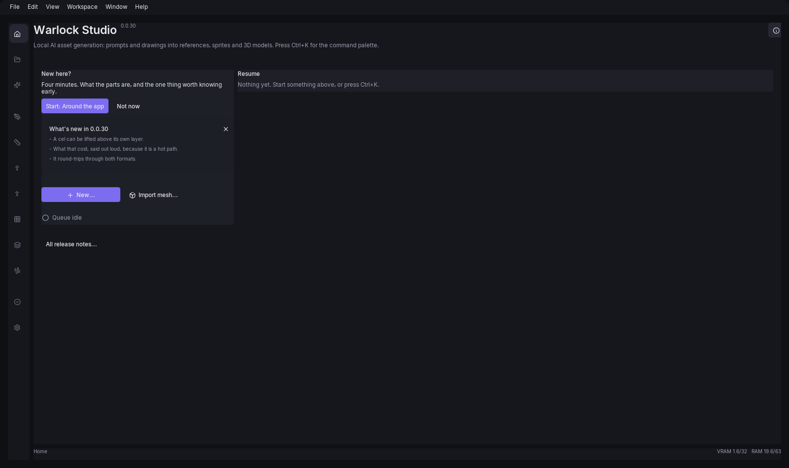

# The Home screen

Warlock Studio opens on Home every time you launch it, not just the first time. That is deliberate:
the workspace assumes you already know which of the two pipelines you are in and what you are
looking at, and neither of those is true a second after a launch.

Home used to be a grid of tiles, and most of those tiles were the navigation again — the same names
under the same glyphs, one click either way, beside a control that is drawn in every mode anyway. So
Home answers the three questions nothing else in the app answered instead: **what changed**, **what
is the machine doing**, and **what was I working on**.

Nothing about Home is remembered. There is no "last mode" setting, and no way to make the app skip
it — a stored mode would be a value with no reader, and the app would drift into disagreeing with
itself about where it opens.

The three answers are two columns, weighted by how often each is the reason you are looking: a
narrow left column holding a card you dismiss once per release, the New… button and one quiet
status line, and then the whole rest of the screen for what you were working on.

## New here?

Above everything else, on a fresh install, is an offer of a **guided tour** — a title, one line
saying how long it takes, a **Start** button carrying the tour's name, and **Not now**. There are
three tours: *Around the app*, which walks the rail and the five stages of Create; *Drawing in
Inker*, which makes a canvas, a stroke, a layer and a frame; and *Writing a tune in Sirens*, which
goes from an empty song to an exported WAV. None of the three needs a GPU or any downloaded weights,
which is deliberate: a tour a fresh install cannot finish is worse than none. The Sirens one adds a
second half of that rule — no step of it waits on hearing anything, so a machine with no sound
device can finish it too.

**The tour points and waits. It never clicks anything for you.** A step highlights one control,
says what it is for, and either advances on **Next** or waits until you have actually done the
thing it describes — clicked that mode, made that stroke. **Back** returns a step, **Read more**
opens the manual chapter the step is about, and `Esc` ends the tour wherever you are. Every tour is
also in the command palette as **Take the tour: …**, so leaving one is never losing it.

The offer is not a modal and never blocks the app. It stands down on its own once you have finished
the tour it names, moves on to the next one, and **Not now** puts it away for good.

## What's new

A card at the top names this build and gives you the first three lines of its release notes, with a
**×** that dismisses it. Dismissing is remembered against the *version*, so the card stays gone until
the next release brings it back — and **All release notes…** at the foot of the screen opens the full
history at any time, this build's entry open and the older ones collapsed under it.

It is read from a `CHANGELOG.md` shipped inside the app, hand-written rather than generated: every
commit in this repository is titled `Warlock vN.N.N` and carries no detail, so a generated list
would be a column of version numbers. If the file is missing or unreadable there is simply no card,
and nothing else on the screen is affected.

The version this build is running is printed beside the title, which is the only place in the UI it
appears.

## Starting something

One **New…** button, and a menu behind it with the seven things this app can begin from nothing: a
2D image, a 3D model, a drawing, a Clay model, a tile map, a sprite atlas and a character. It used to
be six equally loud buttons in a 3-across grid, which is a menu insisting that all of them matter the same amount —
above the thing most people came back for.

Beside it, quieter, is **Import mesh…**. That is the other errand: not starting from nothing, but
bringing in a `.glb` you already have — a character someone modelled for you, a prop from another
tool. You can also drag the file onto Home or onto the Library. Either way it becomes an ordinary
library asset, which means everything that works on a generated mesh works on it too: **Send to
Troupe**, the Poser, the triangle retarget and every export.

An imported mesh keeps whatever rig it arrived with only as far as the library. Warlock fits its
own skeleton when you rig it, because a supplied rig rarely maps onto the one the clips are
authored against — so a mesh that arrives unrigged is no worse off than one that does not.

Clay is the exception, and it is not a way in: dropping a `.glb` there opens it for *editing*, and
it refuses a rigged one outright, because Clay has no skinning and opening it would drop the rig.

## Status

Under it, one quiet line about this machine rather than about the work. Each part that has somewhere
to go is clickable.

| Line | What it says | Where it goes |
|---|---|---|
| Issues | "Everything checks out", "still checking" for the first second or two after launch, or "N things need attention" — amber for a warning, red for something fatal. While the shell setup summary is visible this item is omitted instead of repeating it. | [App settings](41-app-settings.md), opened on **Health**, which names each failing check. |
| Queue | What is running or queued, with a percentage when the worker is reporting one, or "Queue idle". | — |
| Unreviewed | How many finished meshes nobody has judged, when there are any. | [Review](37-review.md). |

There used to be a **Library** line here too, counting assets and disk. It went when Resume became a
grid of those same assets: a count of the thing you are looking at is not news, and the Library is
one click away in the rail.

The Issues line is a different destination from the amber issue count in the status bar, which
opens the read-only Issues popup: the status bar answers "what is wrong right now", and this line
answers "how do I fix it". It exists because a fresh install reaches Home with no weights
downloaded, presses New 2D, and is refused at the door with a download command in the message. That
refusal is correct, but Home offered every way to start work and no way to find out first whether
this install could do any of them.

The unreviewed count is asked for in the background on a timer, never on the frame the screen is
drawn — it is a table scan — so it can lag by up to half a minute. It is not shown at all until an
answer has come back, and not shown when the answer is zero.

## Resume

The rest of the screen is everything you have touched recently, newest first, as a grid of
thumbnails — an asset's own rendered picture where there is one, and the mode's glyph in a frame for
a document that has none yet. A filename and a timestamp are what a computer remembers about your
work; a picture is what *you* remember about it.

That list is genuinely one list. Inker, Clay, Plotter and Packwright each used to keep their own
recent-files history, which meant "the six things you were working on" could not be answered at all:
four separate lists carry an order within themselves and none between them. They are now one
history with a timestamp per entry, and your generated assets are folded in beside them from the
library — an asset row opens in the pane that made it, 2D for a reference or a tile and 3D for
anything else.

Up and Down move between the cells and Enter opens the highlighted one — the ring wraps at both ends,
because a dozen tiles is a menu rather than a list. Hovering moves the highlight too, so the mouse
and the keyboard never disagree about what Enter would do.

If a row names a file that is no longer there, clicking it drops the row and says so rather than
failing silently. A recent list that keeps offering a moved file is worse than a short one.

## Failures

If a startup check failed fatally, or the GPU worker died, the message appears in red under the
title as well as in the banner across the top of every mode. Dismissing the banner does not destroy
the text: it moves into the Issues popup under a **Dismissed** heading, which is the only copy
there is.

See [Troubleshooting](42-troubleshooting.md) for what the individual checks mean.
