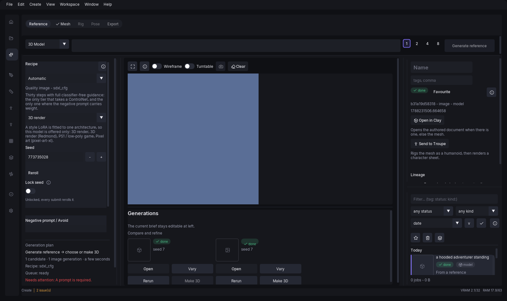

# Generating references

A reference is the picture the mesh will be reconstructed from. Everything in this chapter lives in
the **2D reference** mode's settings pane, in the left sidebar.



## The prompt

The large text box under **Prompt** is where you describe the object. Write the subject and nothing
else — "a weathered wooden crate bound with iron", "a compact energy rifle with panel seams". You do
not need to ask for a plain background, a single object, or a studio render: the app wraps whatever
you write in a fixed template that already asks for all of that, because those are the properties
that make an image reconstruct cleanly.

The prompt is capped at 1000 characters and a counter under the box shows how much you have used.
The counter turns amber inside the last hundred characters.

Beside the box, a **Recent** button opens your last twenty prompts, most recent first and
deduplicated — it appears once you have generated at least one reference, so there is history to
show. Picking one replaces what is in the box. The history is per session and per prompt
text only — if you want a whole recipe back, use **Copy settings to form** from a job's overflow
menu instead, which is described in [Rerun and promotion](35-library-and-jobs.md#rerun-and-promotion).

Under **Negative prompt**, further down the pane, is a second box listing what the image must not
contain. It is pre-filled with the things that most often ruin a reconstruction:

```text
blurry, low quality, multiple objects, cropped, cut off,
text, watermark, signature, busy background, human hands
```

A second subject, or a subject cut off by the frame edge, is the single most common cause of a mesh
that comes out as nonsense — which is why this is a filled-in default rather than an empty field
you have to discover. You can edit it freely, or empty it deliberately. Note that a negative prompt
only has an effect on a model that runs with real classifier-free guidance; the two four-step
distilled defaults ignore it. See [Models and style LoRAs](#models-and-style-loras).

Your text is composed into a fixed template before the image model sees it; the finished job records
the result as `composed_prompt`, which the inspector shows.

The composed prompt has no hard length ceiling. CLIP's text encoders stop at 77 tokens, but the app
splits a longer prompt into several chunks on comma boundaries — never mid-phrase — encodes each
separately and joins them, which the image model's cross-attention accepts without complaint — so a
long prompt costs attention rather than being cut off. The soft limit still applies, though: a
longer conditioning sequence dilutes attention, so your prompt is best kept to a sentence.

## The screen at a glance

Create's Reference stage is a **command bar** across the top and a **recipe column** down the left.
The split is the whole design: the bar is *what to make*, the column is *how to make it*, and no
control appears in both.

The bar holds the four things a common visit touches, on one row that never scrolls:

| Control | What it decides |
| --- | --- |
| **Generation type** | The top-level choice, which decides what everything else means. |
| **Prompt** | The words. Required; everything else has a default. |
| **Count** | How many alternatives one press draws — 1, 2, 4 or 8. |
| **Generate** | The press. Its label names what you are making: *Create image*, *Generate reference*, *Create tileset*. |

At narrow widths the row gives way in a stated order: the prompt shrinks first, then the count is
dropped — its value is restated in the plan block below — and the type and Generate never give way.

The bar is drawn on the Reference stage only. Mesh, Rig, Pose and Export have no brief to state, so
they draw no bar at all and their columns simply start higher.

The column below holds **Recipe** (the model, the style LoRA and the seed), **Style strength** once
a LoRA is chosen, **Negative prompt / Avoid** while the chosen recipe can use one, one section
belonging to the chosen type — **Tileset** or **Sprite sheet**, and nothing at all for the other
three — and one collapsed **Conditioning** disclosure. Its header counts how many of its controls
are switched on, so a closed section never hides a setting that is doing something.

Pinned at the bottom of the column, never scrolling, is the **generation plan**: what the press will
cost, what recipe it will use, and — when Generate is disabled — every reason why, each with a
one-click repair. The button itself carries the first of those reasons as its tooltip.

**Generation type** has five entries: *Image*, *3D Model*, *Seamless Material*, *Tileset* and
*Sprite Sheet*. Two of them are described elsewhere in this chapter — see
[Seamless tiles](#seamless-tiles) and [Sheets](#sheets).

Earlier versions carried a twelve-select creative taxonomy (category, genre, material and the
rest) behind a "More options" reveal. It was retired on 2026-08-17: no taxonomy axis ever measured
a quality win, and your prompt is the brief. Assets generated under it are unaffected — rerolling
or promoting one simply composes without the retired fragments.

**Reset...**, at the foot of the column, puts the whole form back to its first-launch defaults after
a confirm — the prompt, the negative prompt, the model and LoRA, the reference and the run controls,
with a freshly rolled seed. It touches nothing outside this pane: the 3D form is left alone.

## Models and style LoRAs

The **Model** row is one dropdown. Its first entry is *Automatic*, which lets the app resolve a
checkpoint from what you are making and what is installed; every other entry is an installed
checkpoint you are naming yourself.

On *Automatic* the line underneath says what it resolved to — *Quality image · sdxl_cfg*, say —
along with anything that recipe trades. A control whose value is "Automatic" and says nothing else
is a control refusing to tell you what it did.

This used to be three controls: a *Fast*/*Quality* tier, an *Automatic*/*Advanced* switch, and the
checkpoint list. They were three controls for one decision, and the first two only ever chose which
checkpoint. Nothing was lost in folding them — the only *Fast* recipe resolved to the **SDXL 1.0 +
Hyper-SD** entry, so choosing *Fast* and choosing that checkpoint were the same act said two ways.
Pick it from the list when you want four-step draws: eight cheap ones to find out whether an idea is
worth a real one. It gives up structure control and the negative prompt, both of which need a
guidance branch it does not have.

*Quality* is measurably better at holding a shape, which is the property the mesh stage depends on,
so automatic routing chooses it for anything you mean to reconstruct.

A **Tileset** has no model row at all. Its recipe and its style LoRA are fixed, because a sheet
whose cells have to share a palette and a light direction is not a place to vary the machinery, and
the pane says so where the controls would be.

### The model registry

Naming a checkpoint replaces automatic routing. Eleven base models ship in the registry:

| Model | What it is | Runs at |
| --- | --- | --- |
| SDXL-Turbo (fast) | Small and quick, at a quarter of the resolution. Its own separate download. | 512 px, 4 steps, guidance 0 |
| SDXL 1.0 + Hyper-SD (best LoRA response) | Full SDXL weights with a step-distillation LoRA fused on. | 1024 px, 4 steps, guidance 0 |
| SDXL 1.0 + Lightning (4-step) | The same weights and the same idea, distilled a different way — an alternative to compare Hyper-SD against. | 1024 px, 4 steps, guidance 0 |
| Playground v2.5 (highest fidelity, slow) | The best-looking output, and correspondingly slow. | 1024 px, 25 steps, guidance 3.0 |
| SDXL 1.0 (full CFG, structural control) | **The default.** The same weights as the Hyper-SD entry, run the way the checkpoint was trained — the negative prompt and ControlNet both work here. | 1024 px, 30 steps, guidance 7.0 |
| SDXL 1.0 + PAG (full CFG, cleaner structure) | The default's weights and recipe with two training-free sampling upgrades: perturbed-attention guidance and CFG rescale, which counters the washed-out look of high guidance. No new download. | 1024 px, 30 steps, guidance 7.0 |
| SDXL 1.0 + LCM (pixel art) | The same weights again, under a consistency adapter — the recipe the pixel-art LoRA was trained against. | 1024 px, 8 steps, guidance 1.0 |
| Juggernaut XL v9 (photoreal) | A photoreal SDXL finetune, at its own documented recipe. | 1024 px, 35 steps, guidance 4.0 |
| DreamShaper XL (stylised) | The stylised counterpart to Juggernaut. | 1024 px, 25 steps, guidance 7.0 |
| FLUX.2 klein-base 4B (full CFG) | A different architecture entirely, and the slowest thing here. | 1024 px, 50 steps, guidance 4.0 |
| FLUX.2 klein 4B (distilled, 4-step) | The same architecture at the opposite recipe — the negative prompt is inert on it, and it exists so the FLUX.2 pixel-art style can run at the recipe it was trained on. | 1024 px, 4 steps, guidance 1.0 |

The sampler settings travel with the checkpoint and are not yours to set. They are part of the
model's identity: a four-step distilled model run at 25 steps with guidance produces mush, and both
Hyper-SD and Lightning degrade silently without the right timestep spacing.

Three consequences are worth knowing. A **negative prompt** is only encoded when guidance is above
1.0, so it does nothing on the three four-step entries — pick one of the full-CFG models if you want
it honoured. **Structure control** (see [Conditioning on an image](#conditioning-on-an-image)) is
only offered on the SDXL models that run with real guidance, because a ControlNet at guidance 0
fights the hint instead of following it. And **style LoRAs, conditioning and seamless tiles are
SDXL-only**: they are all built against SDXL's internals, so on FLUX.2 the Style LoRA picker is
disabled with a note saying so, and asking for a tile is refused rather than quietly producing one
whose edges do not line up. The negative prompt does work on FLUX.2 — that is why the undistilled
`klein-base` variant is the one that ships.

Only one base model is resident on the card at a time — a 32 GB card holds the reconstruction engine
plus a single image pipeline, not two — so switching between models between jobs costs a reload of
several seconds. FLUX.2 is the exception to *how* it is held: it is large enough that it is streamed
onto the card one piece at a time rather than kept there whole, which makes each job slower but means
it still does not displace the reconstruction engine. Any model whose weights are not on disk is
still listed, with "— weights missing" appended to its name, so you learn at pick time rather than at
job-failure time. Run `warlock doctor` for the exact download command.

**Style LoRAs** are the opposite: they are adapters on whatever pipeline is already resident and
switch for free, with no reload. Five ship:

- **3D render** — a general 3D-render look.
- **3D render (Redmond)** — a second, differently trained take on the same idea.
- **PS1 / low-poly game** — chunky untextured geometry, which is among the easiest things to
  reconstruct cleanly.
- **Pixel art (pixel-art-xl)** — generates on a pixel grid rather than producing a smooth image that
  is later downscaled into one. It defaults to a strength of 1.2 rather than the usual 0.9: below
  that the output keeps SDXL's anti-aliased gradients, and no downscale recovers a clean grid from
  them. It pairs naturally with the LCM base, the recipe it was trained against.
- **Pixel art (FLUX.2 klein)** — the same idea for the other architecture, and the only adapter here
  that is not an SDXL one. It is offered on the two FLUX.2 klein entries and on nothing else. Its
  default strength is 0.0625, far below every other entry, because the adapter declares a trained
  scale of 16 where an ordinary one declares about 2 — the slider means the same thing it always
  did, and this adapter's own strength is simply much larger. Anything above about 0.13 smears and
  the range its model card recommends produces black frames.

An adapter is fitted to one architecture, so the picker offers a model only the styles that fit it.
Choosing a model no style fits disables the picker with a note; choosing one that some styles fit
lists those and says so. A style you picked under a different model stays visible and marked rather
than vanishing, and changing the model clears it with an explanation.

Choosing one reveals a **Strength** slider, from 0 to 1.5, defaulting to the LoRA's own tuned
weight — 0.9 unless the entry says otherwise. The slider is hidden entirely when no LoRA is chosen.
The SDXL LoRAs are trained against full SDXL at 20 to 25 steps with guidance, so they land
noticeably stronger on the SDXL entries than on Turbo.

## Seeds and candidates

Generation is deterministic in its seed: the same form and the same seed produce the same image
every time. The **Seed** section is where you control that.

**References** picks how many candidates one submit queues: 1, 2, 4 or 8. Each is a real job holding
a place in the serial queue, which is why eight is the ceiling. Because each one gets its own seed,
a fan-out of four is the cheapest way to find out whether an idea works at all.

**Seed** is the number itself. **Reroll** replaces it with a fresh random one. **Lock** decides what
happens when you press Generate:

- Unlocked (the default): the seed is rerolled on every submit, so pressing Generate twice on an
  unchanged form gives you two different images rather than the same one twice.
- Locked: the seed is reused, so an unchanged form reproduces exactly. Lock it when you want to
  change one guidance field and see only that field's effect.

Seeds are whole numbers from 0 to 2147483647. The seed shown when the app opens is rolled fresh at
startup and is deliberately not remembered between sessions — otherwise every launch would open on
the same seed and a first Generate would reproduce last week's image.

The mesh has its own separate seed, at the Mesh stage. See
[Mesh parameters](23-generating-meshes.md#mesh-parameters).

### Which candidate to look at first

A fan-out of eight arrives in the order the seeds happened to be drawn in, which is no order at all.
Each finished reference therefore carries a **score**, shown as a percentage on its library card,
and it exists to answer one question: which of these is worth opening first.

Three things go into it, and each is absent-changes-nothing — a term that could not be measured
leaves the score exactly what it would have been without it:

- **Composition** — the framing report the reference stage takes anyway. It leads, because it is the
  one term that predicts whether the mesh stage can succeed at all: a subject cropped at the edge of
  the frame reconstructs badly however handsome it is.
- **Style anchor** — how close the image looks to the reference image attached under *Conditioning*,
  when there is one.
- **Human preference** — how likely a person is to pick this image for this prompt, from PickScore.
  Optional; see [Optional measuring and helper
  models](38-installation.md#optional-measuring-and-helper-models).

**Nothing here rejects anything.** The score sorts, and that is all it does — a low-scoring
candidate is still generated, still kept, and still promotable to a mesh. Turn the whole thing off
with `WARLOCK_RANK=off` (see [Configuration](39-configuration.md#environment-variables)) and the
gallery falls back to submission order.

## Conditioning on an image

Beyond the prompt, you can steer the image with a picture. In the **References** section, either
**Choose an image...** or drop a file onto the window. Everything below the picker stays
hidden until there is an image, because a control with nothing to act on is a control that cannot
do anything.

With a reference loaded, two independent kinds of conditioning become available.

**Appearance** attaches an IP-Adapter — currently one entry, *Appearance reference (IP-Adapter
Plus)*. It conditions on sixteen patch tokens rather than a single pooled embedding, which is the
difference between "the same kind of object" and "this object". Its **Strength** runs from 0 to 1.5
and defaults to 0.6.

**Structure** attaches a ControlNet — currently one entry, *Edge / silhouette lock (Canny)*, which
traces the reference's edges and holds the new image to that shape. It has two controls.
**Strength** (0 to 2.0, default 0.65) is how hard it pulls. **Until** (0 to 1.0, default 0.8) is how
far into the drawing it keeps acting: ending early lets the last steps add detail the reference
never had, while 1.0 holds the shape to the final step and tends to look traced.

Structure needs a checkpoint that runs with real guidance, and the section says so rather than
offering a control that cannot work. Which fix it names depends on which control chose the
checkpoint: with a checkpoint named it says which models could run it, and under automatic routing it
tells you to switch the Recipe to Quality — because the Fast recipe is what picked a guidance-zero
checkpoint on your behalf, and no combo on screen is showing that checkpoint's name.

Clearing the reference clears both selections with it, since neither can be submitted without an
image.

### Starting from the image

Beside *appearance* and *structure* there is a third way to use the reference: **Start from this
image (img2img)**. The drawing then begins from the reference's pixels rather than from noise, and
**Strength** says how far it may go — at 0.30 the layout and most of the surface survive and the
model repaints the rest; at 0.65 only the gist does. It is the control for "this, but cleaner",
"this, but in the style LoRA", or "this, but with the prompt's changes", and it costs nothing
extra on the card. It needs an SDXL-family model, like the other two halves, and it can be combined
with either of them. The inspector records *start image* and *start strength* on the job.

## Approving a reference

When a reference job finishes it appears in the library and, when selected, fills the viewport at
full size. This is the moment the two-stage pipeline exists for: look at the picture before paying
for the mesh.

What to look for is what the reconstruction engine needs. One subject, complete and not cropped by
the frame, filling a good part of it, against a plain background. The app measures this itself and
records a reference report — if it thinks the image will not reconstruct, it says so in the
inspector's **Reference** section, and promoting it asks you to confirm rather than refusing
outright. The rules are heuristics about composition, and you can see the picture they are arguing
about.

If the image is nearly right, you can fix it by hand: **Open in Inker** on the viewport toolbar
opens the reference as a layered document, and saving writes it back in place. See
[Pipeline bridges](28-inker.md#pipeline-bridges).

When you are happy, press **Make 3D** on the card (or select the reference and step to **Mesh**).
That carries the reference and everything it recorded into the mesh stage, where you can override
the mesh-side settings before committing. The next chapter,
[Generating meshes](23-generating-meshes.md), picks up from there.

## 2D exports

A finished reference is an asset in its own right, not only an input to the mesh stage. Its
inspector's **Export** tab offers, alongside the source image:

| Button | File | What it is |
| --- | --- | --- |
| Icon | `icon.png` | A 512-square transparent cutout, centred with a small margin. |
| Sprite | `sprite.png` | The subject alone at native resolution, trimmed, with a recorded pivot. |
| Pixel art | `pixel_32.png`, `pixel_64.png`, `pixel_128.png` | Nearest-neighbour reductions, optionally palette-limited. |
| Manifest | `manifest.json` | What every artifact above is, measured — see below. |

All of them are cut from the same `input.png` the mesh stage uses, and all are derived the first
time you ask for one, then cached — the same rule the mesh exports follow. Editing the reference in
Inker, or rerolling it, makes every derived file stale, and the next request rebuilds it.

The icon is **fitted** inside its square rather than stretched to it, so a tall sword and a round
shield keep their proportions and an icon set stays readable. The sprite is not resized at all: it
records a bottom-centre pivot in the manifest, because that is where an engine puts a standing
character's feet, and an importer that guesses is wrong for half a set.

### Pixel art

The **Pixel art** section of the inspector's Details tab is where the pixel exports are set up and
previewed. **Size** picks which of the three artifacts you are looking at; **Colours** limits the
palette to 8, 16, 32 or 64, or leaves it off; **Palette** maps the export onto a palette file you
supplied, and **Dither** (offered only with one) mixes two nearby entries where a flat map would
pick one.

A palette is a file you drop into the palette directory (`~/.warlock/palettes/` by default — see
[Configuration](39-configuration.md)), in any of the four formats palette sites and editors publish:
Lospec's `.hex`, one `rrggbb` per line, GIMP's `.gpl`, Paint Shop Pro's `.pal` or Paint.NET's
`.txt`. Nothing ships with the app, because a palette is
art direction rather than a default. Colours are matched perceptually (in Oklab) rather than by raw
RGB arithmetic, which is what stops a dark grey being mapped to black and a whole shadow being
eaten. A palette file supersedes the **Colours** cap entirely: the cap is a median cut of the
picture's own colours, and a palette is a decision about which colours exist.

Editing a palette in place re-derives every export that used it — freshness is keyed on the file's
*contents*, not its name, because editing one is the normal way to work on it.

The preview is drawn crisp, at a whole multiple of the artifact's own size — a fractional scale
samples some source pixels twice and others once, which reads as banding and is exactly what the
export avoids. A line underneath says what the file on disk actually is, read from the manifest
rather than from the controls, because the two can disagree: switching size shows a file cut under
an earlier palette setting, and a **Rebuild with these colours** button appears when that is the
case.

Two buttons sit under the controls. **Open in Inker** opens the pixels as a new, unlinked drawing:
the artifact is derived, so it is rebuilt whenever the settings above make the copy on disk stale,
and a document that saved back over it would have that edit thrown away — the first `Ctrl+S` is a
Save As. **Export as PNG** writes the size selected here to wherever you choose. Both derive the
artifact first if it does not exist yet, so neither waits on **Preview pixels**. The
[downloads grid](35-library-and-jobs.md) exports the same files; what these add is that they act on
the size you are looking at.

Both settings are app preferences rather than properties of the job, so they persist across
sessions and apply to whichever reference you are looking at. Changing them re-derives; it never
touches `input.png`, so promoting the reference afterwards feeds the mesh engine the same pixels it
always would have.

The reduction is nearest-neighbour, never a smooth resample: a filtered downscale puts a ramp of
in-between colours along every edge, and hard edges are the one property that makes the result read
as pixel art rather than as a small photograph.

There are two reductions, and which one runs is decided by the *image* rather than by a setting.
A pixel-art model draws logical pixels as square blocks — typically eight screen pixels across — and
that lattice has a phase: the first block rarely starts at the very edge of the frame. When one is
detected, the export takes one output pixel per block, sampled at the block's centre, across the
whole frame, and crops to the subject afterwards; the result is exactly the pixels the model
authored. Cropping first — which is what an ordinary export does — would move the origin off the
lattice by however wide the subject happens to be, and shear the art instead of reducing it. An
ordinary render has no lattice to find and takes the plain path unchanged, which is what every asset
already on disk was cut with. The provenance line says which happened. Palette reduction runs on colour only, with
transparency carried around it, so the cutout survives the quantization exactly.

If you are generating for the pixel exports, ask your prompt for flat shading and a bold
silhouette — the things that survive being made small — and avoid the words "pixel art": at 512 or
1024 the image model draws fake chunky pixels that then alias under the real reduction. The
pixel-art LoRA is the exception, because it authors a genuine pixel grid.

### The manifest

`manifest.json` is the sidecar an importer reads. It records, per artifact, the size, the trim box,
the pivot, the palette it was cut to, and which matte produced it — plus the recipe (seed, model,
prompt) behind the image itself. Per artifact, because a file on disk was cut by whatever was
installed when it was made, not by what is installed now.

If the reference was hand-edited in Inker, the manifest says so beside the recipe: the recipe names
a seed and a model, which after a hand edit is no longer the whole story of the pixels.

## Seamless tiles

Setting **Asset type** to *Seamless Material* switches the whole pane to a different kind of output.
A tile is a repeating texture rather than a subject: it is drawn with
wrapping convolutions, so its left edge continues into its right and its top into its bottom.

The rest of the form means the same thing for a tile as for an object: the prompt describes the
surface ("mossy cobblestone"), and the model, LoRA and negative prompt choose the machinery that
draws it.

A tile cannot be made into a mesh, and the app does not offer to: there is no subject to
reconstruct. It also cannot produce the cutout exports, because every one of them lifts a subject
off its background and a tile *is* background — an icon of one would be the whole frame with a matte
guessed over it.

### Whether it actually tiles

When a tile finishes, the app measures its own wrap seam and reports it in the inspector's **Seam**
section. The number is a ratio, and since 2026-08-30 the ratio it quotes is the wrap seam against
the *largest* step the picture already contains — the seam over its worst interior join. That makes
the threshold fixed by construction rather than fitted: at 1.00 the seam is exactly as large as the
hardest edge the texture has anyway, so at or below 1.00 the app says *likely seamless* and above it
says *visible seam*. Both directions are measured, because an image that wraps one way and not the
other is not a tile, and the worse of the two decides.

The verdict used to divide the seam by the picture's *average* grain, with a threshold of 3.5. That
statistic collapses on flat cells parted by thin hard lines — pixel art, grout, riveted panels —
where the average is near zero and the ratio inflates: on a held-out corpus it called 18 of 72
confirmed-seamless tiles seamed, 15 of them under the pixel-art LoRA the tileset track ships with,
where the new statistic called none. Tiles generated before that change keep the number they were
judged by, and the inspector words them in the old vocabulary ("edge/grain") rather than restating
them in the new one.

*Likely*, not *seamless*, and the hedge is measured: the statistic trades a miss for the false
alarms it removed. A picture whose interior already contains a step as hard as its seam ties at 1.00
and passes — 4 of 44 visibly seamed control units did. The wrapped view below is the real check.

A ratio is hard to calibrate against by eye, so the section also offers a wrapped view: the image
rolled by half, which puts what was the wrap edge through the middle of the frame where a
discontinuity is obvious. It is `wrap_preview.png`, a derived export like any other, and the
Export tab offers it too.

## Sheets

Two of the five asset types make several pictures from one prompt rather than one: **Tileset** and
**Sprite Sheet**. Each brings its own layout section above the model, because what the sheet is a
sheet *of* is the choice everything else follows from — including how long the press will take.

On the Materials layout two checkboxes sit under the list. **Keep one style across the list** draws
the first material on its own and uses it as the appearance reference for every one after it (loads
the IP-Adapter). **Erase the seam** adds one masked pass per material: the tile is rolled so its
wrap join runs through the middle, a band around the join is redrawn in place, and it is rolled back
— use it when the wrap preview shows a join.

### Tilesets

A tileset is a grid of related tiles — grass, path, water, cliffs, props — that share a palette, a
light direction and a style. That sharing is what separates a tileset from a folder of unrelated
pictures, and each of the three **Layout** entries buys it a different way.

| Layout | What it draws | Generations |
| --- | --- | --- |
| **Materials** | One seamless tile per surface you name, laid out eight across. | One per cell. |
| **Terrain set** | Two surfaces, composited into the forty-seven cases of a blob autotile. | Two. |
| **Grid (legacy)** | One 1024 px picture painted through a grid guide and cut into 64 cells. | One. |

*Materials* is the default, and it is the one that actually tiles. Type one surface per line, up to
sixteen lines, and **Draws of each** (1 to 4) says how many times each line is drawn — every draw is
its own full generation on its own seed, so lines × draws is the cell count and 64 is the ceiling.
The counter under the box does that arithmetic while you type, and the sheet is refused above the
ceiling naming both numbers rather than quietly trimming. Each cell is drawn on its own with
wrapping convolutions, exactly as a *Seamless Material* is, which is why a tile cut from this sheet
repeats without a join. The old grid did not: its cells came back as one scene cut up.

*Terrain set* asks for two surfaces instead of a list. **Inside** is what a stroke paints — the
islands, coastlines and peninsulas — and **Outside** is what surrounds it; both are generated, so
both have to be described or the sheet is refused. **Shared setting** is optional and is added to
both, so two separate generations come back sharing a world and a palette ("a temperate coastline").
It is not a description of the join: the join is computed from a coverage field, and drawn edge art
would be cut straight across by it. What comes out is a complete forty-seven-case blob set, and it
lands in **Plotter** with the Terrain tool already working — see
[Tools](31-plotter.md#tools).

*Grid (legacy)* is the original single-generation path. It stays for two reasons and the pane says
both: it is the only layout that offers a **View** other than top-down, and it is how a sheet made
under it is rerun. Its cells are drawn from one guide in which every cell is identical, so they tend
to come back as one scene cut up or as one tile repeated — measured, in
`docs/measurements/2026-08-18-tile-sheet-grid.md`.

**Tile size** lives in the **Tileset** section. **View** is drawn in the layout section
itself, and only by the grid — the other two would be a picker with nothing to pick. What each
offers depends on the layout:

| | Tile sizes | Views |
| --- | --- | --- |
| Materials, Terrain set | 16, 32, 64 | Top-down only |
| Grid (legacy) | 16, 32, 48, 64 | Top-down, 3/4, Isometric |

Both restrictions are arithmetic rather than policy, and switching layout migrates a setting that no
longer fits with a sentence saying why. A seamless material is drawn at 1024 px and reduced, so its
tile size has to divide 1024 exactly — which 48 does not. And a seamless tile has to wrap a square:
an isometric tile is a 2:1 diamond, and a 3/4 tile has a visible front face and cannot tile
vertically. If you want either view, you want the grid.

**3/4 needs subjects with height to show.** It is the same square lattice as top-down, and the whole
difference is what the model is asked to draw, so a sheet of flat flagstones comes back looking the
same either way. Ask it for walls, crates, fences, roofs, a well — anything with a front — and the
difference is unmistakable. This was measured rather than assumed; see
`docs/measurements/2026-08-21-three-quarter-guide.md`.

One palette is applied across the whole sheet in one pass, never per tile — quantized per tile, the
same moss comes out two different greens in two tiles. *Which* palette is yours to choose; see
**The pixel look** below. In the Materials and Terrain set layouts the words that are actually
generated are the ones you type in the layout section, and the **Description** at the top of the
form only names the sheet in the library. A **reference image**, if you attach one under
*References*, shapes the style but is never required.

A tileset cannot be made into a mesh, and offers no cutout exports, for the tile's reasons. To
paint with it, take it into **Plotter** or cut it up in **Packwright** — both read the sheet from
the library like any other asset.

### Sprite sheets

The *Sprite Sheet* asset type turns your prompt into a character and then into a sheet of it. The
**Sprite layout** section asks two things.

**Action** is what the character is doing: *Turnaround (still views)*, or one of the animated
actions this installation has a pose guide for. Seven ship — idle, walk, run, attack, cast, hurt and
jump — but the menu is discovered from the guide files on disk rather than hardcoded, because a
guide is art and they land one at a time: an action with no guide behind it would be an unposed
figure conditioned on nothing, so it is not offered at all.

**Directions** is how many ways the character is drawn facing. **One direction is one generation**,
so this is the control that decides whether a press is one job or eight, and the line underneath
states the whole bill before you press it: cells, generations, drafts and roughly how long. Only the
direction counts with a guide are offered, which today means eight and only eight.

**The size is gated on the action, and this catches people out.** The pixel-art model spends about
eight generation pixels on one art pixel, and one direction is never split across two generations —
so all of an action's frames have to fit inside one 1024 px frame at eight times the cell size. At
32 px every action fits; at 48 px and 64 px only the four-frame ones do, which today means idle and
hurt. Ask for an eight-frame run at 64 px and it is refused naming both numbers — but you will
rarely see that, because the pane shortens the **Cell size** ladder first and says
which action shortened it.

A finished sheet carries **animation tags and per-frame durations**, one tag per direction —
`walk_front`, `walk_front_left` and so on — with the action's own frame time and whether it loops.
So a sheet arrives in Inker with its timeline already tagged and reaches an engine knowing its own
frame rate. A turnaround carries none, deliberately: four still views are not an animation, and
tagging them would put four one-frame loops in the timeline that mean nothing to play.

This asset type is two steps and shows as two rows in the library: the character is drawn first and
kept as its own asset, and candidate sheets are then imagined from it. A small sheet gets two to
pick between; past sixteen cells it gets one, because a second guess at eight bands costs more than
it is worth. The two steps are deliberate — a sheet you dislike still leaves you the drawing it was
made from, to reroll, edit or synthesise again with different settings. An attached reference shapes
the character.

The drafts appear under **Sprite sheet** in the inspector when the character is selected. See
[Sprite sheets](27-sprite-sheets.md#from-a-single-drawing) for what to do with them.

### The pixel look

In the type's own section, below the size controls and the working-resolution choice, both
sheet types offer the same two settings and the sprite sheet offers a third.

**Palette** maps every pixel to the nearest colour of a palette you authored, instead of to the
colours this particular render happened to contain. It is the single highest-leverage art input in
the program: a derived table is the average of whatever came back, which is where "muddy" comes
from, while a designed ramp is a decision. The picker appears once you have palette files
installed — `.hex`, `.gpl`, `.pal` or `.txt` in the palette folder (see
[Configuration](39-configuration.md)) — and also when the form names a palette that is no longer
there, listed and marked rather than silently reverting to *Derived from the render*. Naming the
same palette on each run is how a set of sheets is kept on one set of colours.

**Dither** adds an ordered 4×4 offset before each pixel picks its colour, so a gradient reads as a
texture rather than as a band. It works with or without a named palette: with none, the sheet still
derives its own table and dithers against that. How visible it is depends on how far apart the
colours are — a four-colour ramp dithers unmistakably and a sixty-four-colour one barely at all.

**Outline**, on the sprite sheet only, darkens the edge of each frame: *None*, *Inside* or *Around*.
*Inside* recolours the character's own edge pixels, so it cannot change the silhouette or the pivot;
*Around* grows the silhouette by a pixel. *Inside* is the default because a synthesised cell has no
guaranteed margin — the model filled the atlas as it liked, and a frame already touching its cell
edge has nowhere to grow into, so *Around* would clip it. There is deliberately no outline on a tile
sheet: a tile is opaque edge to edge,
so an outline finds the border of every cell and draws a grid line around all of them rather than
around anything in them.
